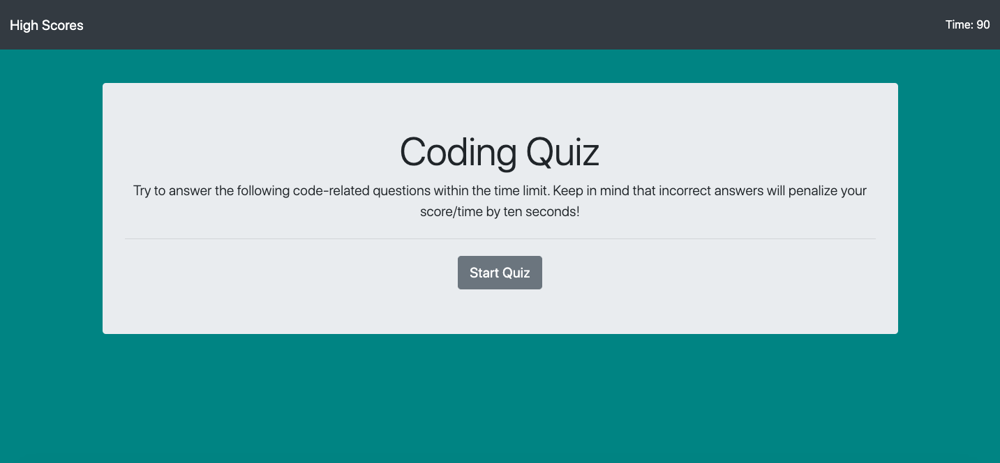

# code-quiz
Coding quiz for bootcamp homework #4

Link to GitHub page: https://lilicecilia23.github.io/code-quiz/
Link to GitHub repo: https://github.com/LiliCecilia23/code-quiz

Technologies used: JavaScript, HTML, CSS, Bootstrap

This is a 5 question coding quiz that is built using JavaScript, HTML, and CSS.
You start with 90 seconds and 10 seconds are deducted each time you get a question 
wrong. At the moment, the quiz isn't working 100% correctly and is definitely a work
in progress. Once the user finishes the quiz they will (eventually) be able to store
their score and initials on the high score page using local storage.
